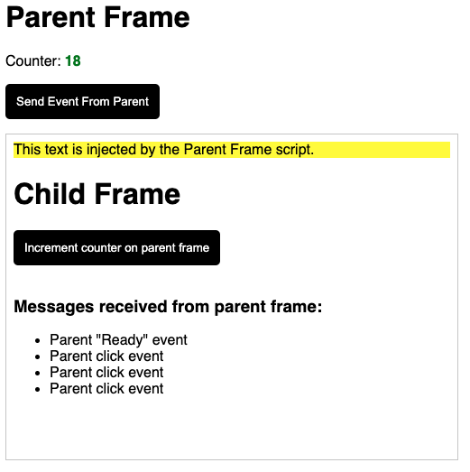

# 🔗 Frame Events

Frame Events is a communication layer library between the DOM and iframes allowing for secure parent and child 2-way communication using the `window.postMessage` method.

[DOCS: Working with Frame Events](./docs/working-with-frame-events.md)

# Mechanism

Frame Event allows for two documents to communicate with one another. The library needs to exist on both documents and consists of two classes that needs be instantiated in each document accordingly. A `ParentFrame` is instantiated in the parent document and a `ChildFrame` is instantiated in the embedded document. Frame events make use of the `Window.postMessage()` method and the `onmessage` event handler to broker messages between.


Parent document:
- ParentFrame instance initiated
- On iframe load it sends the ready event (or errors)

Embedded document:
- ChildFrame instance initiated with a subscriber callback
- On receiving a parent ready event:
  - Register methods and listeners
  - Add 3rd party scripts
  - Fire Subscriber callback

Events are sent two way, parent frame to child frame and child frame to parent frame.


Parent document

## Example Project

An example is included in the project in the `/example` folder. Run the following command to see it in action:

```bash
  yarn start:demo
```

Go to `http://localhost:3030` to see the demo app.



## Example Code

In the parent document:

```typescript
const state = {
  counter: 0,
};
const myAPI = new ParentFrame({
  child: document.querySelector("iframe"),
  methods: {
    updateCounter: function () {
      state.counter++;
      this.send("counterUpdated", {
        counter: state.counter,
      });
    },
  },
  listeners: ["counterUpdated"],
  scripts: ['<script src=""></script>', '<script src=""></script>'],
});
```

Remember to pass the parent origin and the placement as query parameters: `_origin=PARENT_HOST&_placement=PLACEMENT_NAME`:

```html
<iframe
  src="http://childorigin/embedded.html?_origin=http://parentorigin&_placement=myPlacement"
></iframe>
```

In the embedded document:

```typescript
const myChildAPI = new ChildFrame(function (data) {
  // Communication was succesfully established
  const { listeners, methods } = data;

  // Listen for events
  myChildAPI.listeners.counterUpdated((event) => {});

  // Fire commands
  document.querySelector("button").addEventListener("click", function () {
    myChildAPI.run.updateCounter();
  });
});
```

# License
Created by WeTransfer.

Frame Events is MIT licensed.